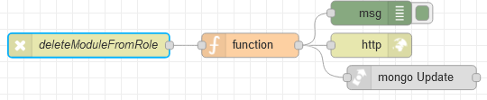

# Потік `DELETE /deleteModuleFromRole`

Видаляє модуль за вказаним `moduleId` у вказаної ролі за її `_id`. Використовується на сторінці  [AdminRoles](page_adminroles.md).

```json
{
	"_id": "{{roles_table.selectedRow._id}}",
	"moduleId": {{modules_field_delete.selectedOptionValues}}
}
```



## function

```js
msg.collection = "admin_roles";

msg.query = {
   "_id": objectid(msg.payload._id)
};

const deleteModulesId = msg.payload.moduleId.map(i => objectid(i));

msg.payload = {
    $pull: {
        permissions: {
            moduleId: {
                $in: deleteModulesId
            }
        }
    }
}

return msg;
```

