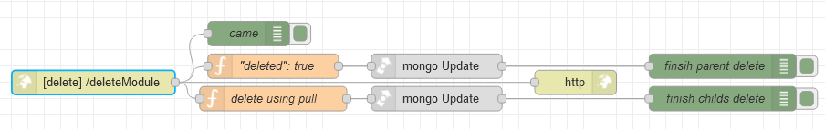

# Потік `DELETE /deleteModule`	

Помічає як видалений вказаний модуль (сторінку), та видаляє на неї посилання з усіх ролей. Викликається зі сторінки [Modules](page_modules.md)

```json
{
	"_id": "{{TableParent.selectedRow._id}}"
}
```




## "deleted": true

```js
msg.collection = "admin_modules";

// для документу з вказаним _id
msg.query = {
    "_id": objectid(msg.payload._id)
};

// позначити як видалене
msg.payload = {
    $set: {
        deleted: true
    }
}

return msg;
```

## delete using pull

```js
msg.collection = "admin_roles"

// для ролей, що мають такий moduleId
msg.query = {
    "permissions.moduleId": objectid(msg.payload._id)
}

// видалити усі посилання на модуль
msg.payload =
    { $pull: { // Видаляє всі елементи масиву, які відповідають заданому запиту. 
        "permissions": { 
            "moduleId": objectid(msg.payload._id) 
        } 
    } }

return msg;
```

