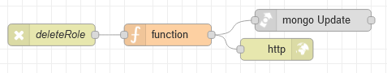

# Потік `DELETE /deleteRole`

Виадаляє роль за вказаним ID, використовується на сторінці [AdminRoles](page_adminroles.md) .

```json
{
	"_id": "{{roles_table.selectedRow._id}}"
}
```



## function

```js
msg.collection ="admin_roles"

msg.query={
    _id: objectid(msg.payload._id)
}

msg.payload={
    $set:{
        deleted: true
    }
}
return msg;
```

