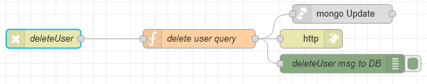

# Потік `DELETE /deleteUser`

Видаляє користувача з системи (вірніше помічає його як видалений). Використовується на сторінці [User Management](page_usermanagement.md)



## delete user query

```js
msg.collection = "admins"

msg.query = {
    "_id": objectid(msg.payload._id)
};

msg.payload = {
    $set: { "deleted": true }
}

return msg;
```

