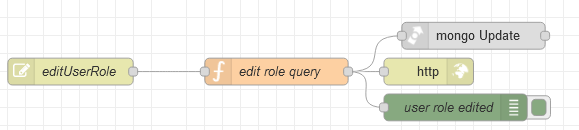

# Потік `PUT /editUserRole`

Змінює роль для вказаного в `_id` користувача. Використовується на сторінці [User Management](page_usermanagement.md)

```json
{
	"role": "{{field_user_role.selectedOptionValue}}",
	"_id": "{{Table1.selectedRow._id}}"
}
```



## edit role query

```js
msg.collection = "admins";

msg.query = {
    "_id": objectid(msg.payload._id)
}

msg.payload = {
    $set: {
        "roles": [objectid(msg.payload.role)]
    }
}

return msg;
```

