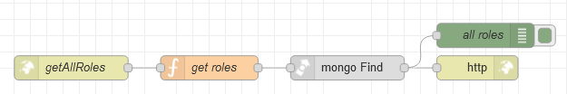

# Потік `GET /getAllRoles`

Обробляє запит на отримання всіх ролей, викликається з [User Management](page_usermanagement.md)



## get roles

```js
msg.collection = "admin_roles"
let match = {};
if (msg.payload.name != "," && msg.payload.name) {
    match = {
        name: {$regex: msg.payload.name, 
               $options: "i" }
    }
}

msg.payload = {
    deleted: false, 
    ...match
}
return msg;
```

