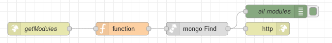

# Потік `GET /getModules`

Запитує перелік усіх модулів. Використовується на сторінці [AdminRoles](page_adminroles.md) 

```
GET {{main.env.nodeUrl}}/getModules
```



## function

```js
msg.collection="admin_modules"
msg.payload={
    deleted:false
}
return msg;
```

