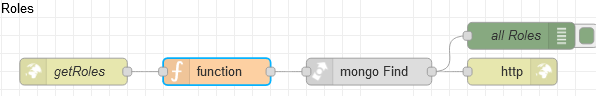

# Потік `GET /getRoles`

Обробляє запит на перелік ролей AdminRoles, наприклад зі сторінки [AdminRoles](page_adminroles.md)



## function

```js
msg.collection="admin_roles"
msg.payload={
    deleted: false
}
return msg;
```

