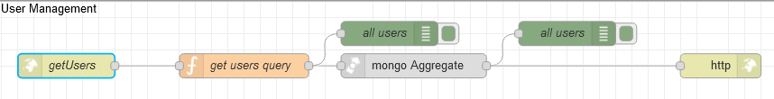

# Потік `GET /getUsers`

Отримує інформацію про користувачів в заданому форматі. Використовується на сторінці  [User Management](page_usermanagement.md). 



## get users query

```js
msg.collection = "admins";

msg.payload=[
    {
      $match:{
        deleted:false
      }
    },
    {
      $lookup: {
       "from": "admin_roles",
       "localField": "roles",
       "foreignField":"_id",
       "as": "role_items"
     }
    }
]
return msg;
```

