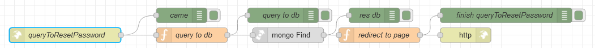

# Потік `GET /queryToResetPassword`

Запит на скидання паролю. Приходить через пошту, з листа [/sendEmailForResetPassword](node_sendEmailForResetPassword.md)



## query to db

```js
msg.collection = "admins";
msg.token = msg.payload.token;

msg.payload = {
    resetPassToken: msg.payload.token
}

return msg;
```

## redirect to page

```js
const dateNow = new Date().getTime();
const uiUrl = env.get("uiUrl");

if (msg.payload[0].resetPassExpireToken > dateNow) {
    msg.statusCode = 302
    msg.headers = {
        "Access-Control-Allow-Origin": "*",
        "Access-Control-Allow-Credentials": true,
        "location": `${uiUrl}/ResetPassword?token=${msg.token}`
    }
} else {
    msg.payload = '<h1>Link expired</h1>';
};

return msg;

```

