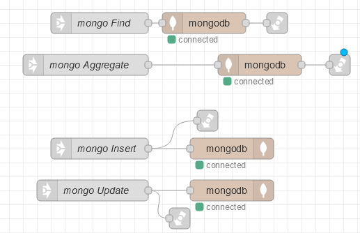

[До розділу](README.md)

# Реалізація авторизаційного шаблону в Node-RED

Шаблон в Node-RED має два потоки-закладки:

- `Links` - взаємодія з базою даних MongoDB 
- `Auth Module` - реалізація API самого шаблону

## Links

Даний потік-закладка реалізовує взаємодію з базою даних MongoDB через вузли бібліотеки `node-red-node-mongodb` про яку можна прочитати за [цим посиланням](https://github.com/pupenasan/NodeREDGuidUKR/blob/master/storage_mongodb/mongodb.md). Зміст потоку показаний на рис.1

рис.1.

На закладці реалізовано 4-ри потоки, кожен з яких виконує певний запит. Потоки передбачають використання вузлів `link call`, тому по факту працюють як підпрограми і завершуються поверненням в точку виклику. 

- `mongo Find` - забезпечує вибірку даних з використанням операції `find`. Критерії пошуку задаються в `msg.payload`. 
- `mongo Aggregate` - забезпечує доступ до конвеєра агрегації з використанням операції `agregate`, при цьому доступ до конвеєра агрегації вказується через `msg.payload` як масив конвеєра. 
- `mongo Insert` -  вставляє об'єкт в колекцію 
- `mongo Update` - оновлює об'єкт в колекції

## Auth Module

Цей потік-зкладка реалізовує API та логіку самого шаблону. Тут зупинимося на загальному призначенні кожного потоку. Опис кожного з них надається за посиланням. Кожен потік починається з вузла `http-in` , який означує відповідну кінцеву точку HTTP API. 

### Група Authorization

- [/login](node_login.md) - обробляє логін користувача зі сторінки UI [Login](page_login.md). 
- [/signout](node_signout.md) - обробляє вихід користувача при вході на сторінку UI [Login](page_login.md). 
- [/registration](node_registration.md) - обробляє запит зі сторінки UI [реєстрації](page_registration.md) 
- [/repeatRegisterEmail](node_repeatRegisterEmail.md) - обробляє запит на повторну відправку запиту на підтвердження з сторінки [Registered](page_registered.md)
- [/check_token](node_check_token.md) - до даної кінцевої точки йде звернення при перемиканні на усі сторінки, окрім тих, що задані в `Pages withou authorization`, деталі налаштування описані [Загальні налаштування UI](app_cfg.md)

### Група Roles

- [/getRoles](node_getRoles.md) - обробляє запит на перелік ролей AdminRoles, наприклад зі сторінки [AdminRoles](page_adminroles.md)
- [/getAllRoles](node_getAllRoles.md) - обробляє запит на отримання всіх ролей, викликається з [User Management](page_usermanagement.md)
- [/createRole](node_createRole.md) - обробляє запит на створення ролі зі сторінки [AdminRoles](page_adminroles.md) (ModalCreateRole)
- [/addModuleToRole](node_addmodulestoroles.md) - Обробляє запит на створення ролі зі сторінки [AdminRoles](page_adminroles.md) (ModalAddModule)
- [/updateRole](node_updateRole.md) - ???
- [/deleteRole](node_deleteRole.md) - Виадаляє роль за вказаним ID, використовується на сторінці [AdminRoles](page_adminroles.md) .
- [/deleteModuleFromRole](node_deleteModuleFromRole.md) - видаляє модуль за вказаним `moduleId` у вказаної ролі за її `_id`. Використовується на сторінці [AdminRoles](page_adminroles.md).

### Група Modules

- [/getModules](node_getModules.md) - Запитує перелік усіх модулів. Використовується на сторінці [AdminRoles](page_adminroles.md) 
- [/createParentModule](node_createParentModule.md) - Створює батьківський модуль з вказаним іменем та позицією в меню. Створюється зі сторінки [Modules](page_modules.md)
- [/updateParentModule](node_updateParentModule.md) - Змінює інформацію модуля за його `_id`. Зміна відбувається на сторінці [Modules](page_modules.md)
- [/deleteModule](node_deleteParentModule.md) - Помічає як видалений вказаний модуль (сторінку), та видаляє на неї посилання з усіх ролей. Викликається зі сторінки [Modules](page_modules.md)
- [/createChildModule](node_createChildModule.md) - Створення дочірнього модуля з вказаною назвою у вказаному батьківському модулі у вказаній позиції зі сторінки [Modules](page_modules.md)
- [/updateChildModule](node_updateChildModule.md) - Змінює позицію дочірнього модулю в меню батьківського модулю. Налаштовується на сторінці [Modules](page_modules.md). 
- [/deleteChildModule](node_deleteChildModule.md) - Видаляє дочірній модуль з батьківського модулю. Проводиться на сторінці [Modules](page_modules.md).

### Група User Management

- [/getUsers](node_getUsers.md) - Отримує інформацію про користувачів в заданому форматі. Використовується на сторінці  [User Management](page_usermanagement.md). 
- [/editUserRole](node_editUserRole.md) - Змінює роль для вказаного в `_id` користувача. Використовується на сторінці [User Management](page_usermanagement.md)
- [/deleteUser](node_deleteUser.md) - Видаляє користувача з системи (вірніше помічає його як видалений). Використовується на сторінці [User Management](page_usermanagement.md)
- [/createUser](node_createUser.md) - Створює користувача за вказаним іменем, прізвищем, поштою, роллю та пароллю. Використовується на сторінці [User Management](page_usermanagement.md)

### Група Confirm Email Registration

- [/verifyToken](node_verifyToken.md) - підтвердження пошти користувача, передається token у вигляді параметра

### Група Reset Password

- [/sendEmailForResetPassword](node_sendEmailForResetPassword.md) - Відправляє запит на відправку на вказаний email запиту про скидання паролю. Використовується на сторінці  [Qery To Reset Password](page_querytoResetPassword.md). 
- [/queryToResetPassword](node_queryToResetPassword.md) - Запит на скидання паролю. Приходить через пошту, з листа [/sendEmailForResetPassword](node_sendEmailForResetPassword.md)
- [/resetPassword](node_resetPassword.md) - Запит на скидання паролю. Приходить зі сторінки [ResetPassword](page_ResetPassword.md)
