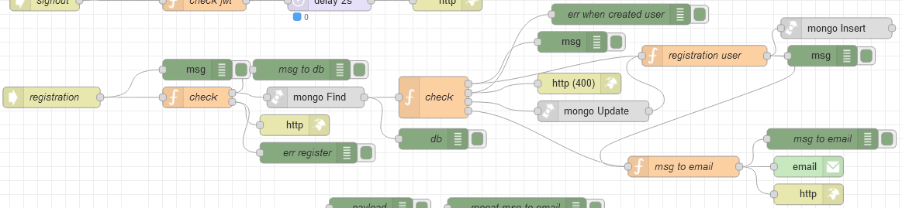

# Потік `POST /registration`

Обробляє запит зі сторінки UI [реєстрації](page_registration.md) 

```json
{
	"firstname":"{{firstname_field.text}}",
	"lastname":"{{lastname_field.text}}",
	"email":"{{email_field.text}}",
	"password":"{{pass_field.text}}"
}
```



## check 1

```js
const regexEmail = /^(([^<>()[\]\.,;:\s@\"]+(\.[^<>()[\]\.,;:\s@\"]+)*)|(\".+\"))@(([^<>()[\]\.,;:\s@\"]+\.)+[^<>()[\]\.,;:\s@\"]{2,})$/i;
const regexPassword = /^(?!.*\s).{8,}/;
const email = msg.payload.email.toLowerCase();

if (!regexEmail.test(email)) {
    msg.statusCode = 401;
    msg.payload = {
        data: "Email is invalid",
        code: 401
    }

    return [null, msg];

} else if (!regexPassword.test(msg.payload.password)) {
    msg.statusCode = 401;
    msg.payload = {
        data: "The password is invalid. The value must be at least 8 characters and without whitespaces",
        code: 401
    }

    return [null, msg];

} else {
    msg.collection = "admins";
    msg.oldpayload = msg.payload;

    msg.payload = {
        email: email,
        deleted: false
    };

    return [msg, null];
}
```


## check 2

```js
if (msg.payload.length > 0) {
    if (!msg.payload[0].active) {
        const decoded = jwt.verify(msg.payload[0].verifyToken, 'test');
        const dateNow = new Date().getTime();

        if (decoded.exp < dateNow) {
            msg.query = { _id: objectid(msg.payload[0]._id) }
            msg.payload = {
                $set: {
                    deleted: false
                }
            }

            return [null, null, msg, null]
        } else {
            msg.payload = {
                verifyToken: msg.payload[0].verifyToken,
                email: msg.payload[0].email
            }

            return [null, null, null, msg]
        }
    } else {
        msg.payload = {
            data: "This email address already exists",
            code: 400,
        }
        return [null, msg, null, null]
    }
}
else {
    return [msg, null, null, null]
}

```

## registration user

```js
let randomColor = "#" + Math.floor(Math.random() * 16777215).toString(16);
let encryptedPassword = await bcrypt.hash(msg.oldpayload.password, 10);
const verifyToken = await jwt.sign(
    { id: Math.round(Math.random()) },
    "test",
    {
        expiresIn: "150m",
    }
);

msg.cookies = {};
msg.cookies["verify_token"] = verifyToken;
msg.cookies["email_register"] = msg.oldpayload.email;

msg.payload = {
    "_id": objectid(),
    "deleted": false,
    "avatarColor": randomColor,
    "createdAt": new Date(),
    "roles": [objectid("646374a41f21a300112a164f")],
    "active": false,
    "firstname": msg.oldpayload.firstname,
    "lastname": msg.oldpayload.lastname,
    "email": msg.oldpayload.email.toLowerCase(),
    "password": encryptedPassword,
    verifyToken,
    resetPassToken: "",
    resetPassExpireToken: null
}

return msg;
```

## msg to email

```js
const token = msg.payload.verifyToken;
const nodeUrl = env.get("nodeUrl");
const url = `${nodeUrl}/verifyToken?token=${token}`;
const text = `
<div style="padding: 10px 0; color: black;">
    <h1>Confirm Your Email Address</h1>
    <p>Tap the button below to confirm your email address. If you didn't create an account, you can delete this email.</p>
    <a href="${url}" target="_blank" style="margin: 10px 0; display: inline-block; padding: 16px 36px; font-family: 'Source Sans Pro', Helvetica, Arial, sans-serif; font-size: 16px; color: #ffffff; text-decoration: none; border-radius: 6px; background: #95e4f0;">Confirm</a>
</div>
`;

msg.to = msg.payload.email;
msg.topic = 'Verify';
msg.payload = text;

return msg;
```

