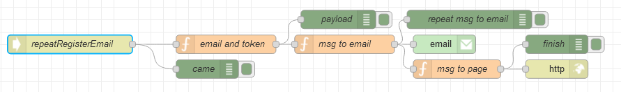

# Потік `POST /repeatRegisterEmail`

Обробляє запит на повторну відправку запиту на підтвердження з сторінки [Registered](page_registered.md)



## email and token

```js
msg.payload = {
    verifyToken: msg.req.cookies.verify_token,
    email: msg.req.cookies.email_register.toLowerCase()
}
msg.email = msg.req.cookies.email_register.toLowerCase();

return msg;
```

## msg to email

```js
const token = msg.payload.verifyToken;
const nodeUrl = env.get("nodeUrl");
const url = `${nodeUrl}/verifyToken?token=${token}`;
const text = `
<div style="padding: 10px 0; color: black;">
    <h1>Confirm Your Email Address</h1>
    <p>Tap the button below to confirm your email address. If you didn't create an account, you can delete this email.</p>
    <a href="${url}" target="_blank" style="margin: 10px 0; display: inline-block; padding: 16px 36px; font-family: 'Source Sans Pro', Helvetica, Arial, sans-serif; font-size: 16px; color: #ffffff; text-decoration: none; border-radius: 6px; background: #95e4f0;">Confirm</a>
</div>
`;

msg.to = msg.payload.email;
msg.topic = 'Verify';
msg.payload = text;

return msg;
```

## msg to page

```js
msg.payload = {
    data: `We sent the email "${msg.email}" again. Please, check your inbox or spam.`
}
return msg;
```

