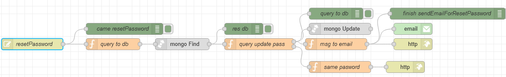

# Потік `PUT /resetPassword`

Запит на скидання паролю. Приходить зі сторінки [ResetPassword](page_ResetPassword.md)

```json
{
	"password": "{{InputPassword.text}}",
	"token": "{{main.URL.queryParams.token}}"
}
```



## query to db

```js
msg.newPassword = msg.payload.password;

msg.collection = "admins";
msg.payload = {
    resetPassToken: msg.payload.token
}

return msg;
```

## query update pass

```js
const dateNow = new Date().getTime();
let check = await bcrypt.compare(msg.newPassword, msg.payload[0].password);
let encryptedPassword = await bcrypt.hash(msg.newPassword, 10);

msg.oldpayload = msg.payload;

if (msg.payload[0].resetPassExpireToken < dateNow) {

    msg.payload = '<h1>link expired</h1>';

} else {

    if (!!check) {

        msg.statusCode = 401;
        msg.payload = {
            data: 'The password must be different from the previous one',
            code: 401
        }

        return [null, msg];

    } else {
        
        msg.collection = "admins";
        msg.query = {
            _id: objectid(msg.payload[0]._id)
        }
        msg.payload = {
            $set: {
                password: encryptedPassword,
                resetPassToken: "",
                resetPassExpireToken: null
            }
        }
        
        return [msg, null];

    }

}
```

## msg to email

```js
const uiUrl = env.get("uiUrl");
const url = `${uiUrl}/Login`;
const dateChanged = new Date().toString().slice(0, 24);
const text = `
<div style="padding: 10px 0; color: black;" display: block;>
    
    <h1 text-align="center" >Password changed!</h1>
    <p>
        Your password has been changed successfully. 
        This is a confirmation that your password was changed at <b>${dateChanged}</b>
        <br><br>
        Use your new password to log in.
    </p>
    <a href="${url}" target="_blank" style="margin: 10px 0; display: inline-block; padding: 16px 36px; font-family: 'Source Sans Pro', Helvetica, Arial, sans-serif; font-size: 16px; color: #ffffff; text-decoration: none; border-radius: 6px; background: #72D393;">
        <b>LOGIN NOW</b>
    </a>
</div>
`;

msg.to = msg.oldpayload[0].email;
msg.topic = 'Password changed';
msg.payload = text;

return msg;
```

## same pasword

```js

return msg;
```

