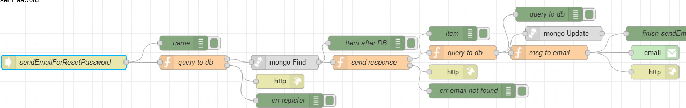

# Потік `POST /sendEmailForResetPassword`

Відправляє запит на відправку на вказаний email запиту про скидання паролю. Використовується на сторінці  [Qery To Reset Password](page_querytoResetPassword.md). 

```json
{
	"email": "{{InputEmail.text}}"
}
```



## query to db

```js
const regexEmail = /^(([^<>()[\]\.,;:\s@\"]+(\.[^<>()[\]\.,;:\s@\"]+)*)|(\".+\"))@(([^<>()[\]\.,;:\s@\"]+\.)+[^<>()[\]\.,;:\s@\"]{2,})$/i;
const email = msg.payload.email.toLowerCase();

if (!regexEmail.test(email)) {

    msg.statusCode = 401;
    msg.payload = {
        data: "Email is invalid",
        code: 401
    }

    return [null, msg];

} else {
    msg.collection = "admins";

    msg.email = msg.payload.email;

    msg.payload = {
        email: email,
        deleted: false
    }

    return [msg, null];
} 

```

## send response

```js
if (msg.payload.length === 0){
    msg.statusCode = 401;

    msg.payload = {
        data: "Forbidden! Incorrect email.",
        code: 401
    }
    return [null, msg]
}

msg.payload = msg.payload[0];
    
return[msg, null]

```

## query to db

```js
// Add 30 minutes
const date = new Date();
const expireTime = date.setMinutes(date.getMinutes() + 30);
const token = crypto.randomBytes(64).toString('hex');

msg.oldpayload = msg.payload;
msg.token = token;

msg.cookies = {};
msg.cookies["user_email"] = msg.email;

msg.collection = "admins";
msg.query = {
    _id: objectid(msg.payload._id)
}
msg.payload = {
    $set: {
        resetPassToken: token,
        resetPassExpireToken: expireTime
    }
}

return msg;
```

## msg to email

```js
const nodeUrl = env.get("nodeUrl");
const url = `${nodeUrl}/queryToResetPassword?token=${msg.token}`;

const text = `
<div style="padding: 10px 0; color: black;">
    <h1>We received a request to reset your password</h1>
    <p>Use the link below to set up a new password for your account. If you did not request to reset your password, ignore this email and the link will expire on its own.</p>
    <a href="${url}" target="_blank" style="margin: 10px 0; display: inline-block; padding: 16px 36px; font-family: 'Source Sans Pro', Helvetica, Arial, sans-serif; font-size: 16px; color: #ffffff; text-decoration: none; border-radius: 6px; background: #2E3D49;">
        SET NEW PASSWORD
    </a>
</div>
`;

msg.to = msg.oldpayload.email;
msg.topic = 'Reset password';
msg.payload = text;

return msg;
```

