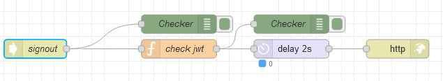

# Потік `POST /signout`

Обробляє вихід користувача при вході на сторінку UI [Login](page_login.md). 

```
POST {{main.env.nodeUrl}}/signout
```



## check jwt

```js
msg.cookies={
    user_token: null
}

msg.payload={
    success: true
}

return msg;
```

