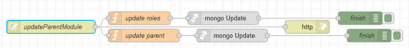

# Потік `PUT /updateParentModule`

Змінює інформацію модуля за його `_id`. Зміна відбувається на сторінці [Modules](page_modules.md)

```json
{
	"name": "{{name_field_edit.text}}",
	"position": {{position_field_edit.text}},
	"icon": "{{icon_field_edit.text}}",
	"_id": "{{TableParent.selectedRow._id}}"
}
```



## update roles

```js
msg.collection = "admin_roles";

msg.query = {
    "permissions.moduleId": objectid(msg.payload._id)
    }

msg.payload = {
    $set: {
        "permissions.$.module": msg.payload.name
    }
}

return msg;
```

## update parent

```js
msg.collection = "admin_modules";

msg.query = {
    _id: objectid(msg.payload._id)
};

msg.payload = {
    $set: {
        icon: msg.payload.icon,
        position: msg.payload.position,
        name: msg.payload.name
    }
}

return msg;
```

