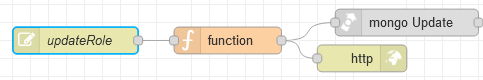

# Потік `PUT /updateRole`

???



## function

```js
msg.collection ="admin_roles"

msg.query={
    _id: objectid(msg.payload._id)
}

msg.payload={
    $set:{
        name: msg.payload.name
    }
}
return msg;
```

