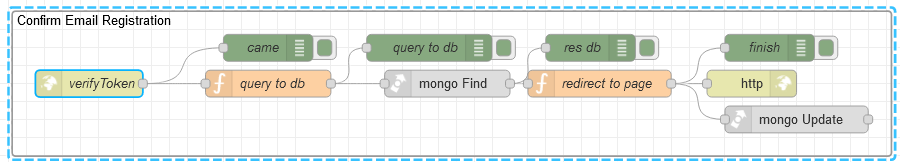

# Потік `GET /verifyToken`

Обробляє запи



## query to db

```js
msg.collection = "admins";
msg.cameToken = msg.payload.token;

msg.payload = {
    verifyToken: msg.payload.token
}

return msg;
```

## redirect to page

```js
node.warn(msg)
const token = await jwt.sign(
    { user_id: msg.payload[0]._id, email: msg.payload[0].email },
    "test",
    {
        expiresIn: "150m",
    }
);

const uiUrl = env.get("uiUrl");

msg.token = token
msg.statusCode = 302
msg.headers = {
    "Access-Control-Allow-Origin": "*",
    "Access-Control-Allow-Credentials": true,
    "location": `${uiUrl}/Login`
}

msg.collection = "admins";
msg.query = {
    _id: objectid(msg.payload[0]._id)
}
msg.payload = {
    $set: {
        active: true,
        verifyToken: null
    }
}

node.send(msg)
```

