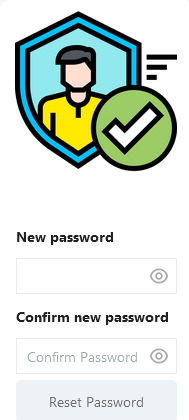

# Reset Password

## Page



### InputPassword

Valid

```js
{{InputPassword.text.length > 7}}
```

### InputConfirmPassword

Valid

```js
{{InputPassword.text === InputConfirmPassword.text}}
```

### Button1 (Reset Password)

Disabled

```js
{{!InputPassword.isValid || !InputConfirmPassword.isValid }}
```

onClick

```js
{ { resetPassword.run(() => navigateTo('PasswordChanged', {}), () => {}) } }
```


## APIs

### resetPassword

```
PUT {{main.env.nodeUrl}}/resetPassword
```

body

```js
{
	"password": "{{InputPassword.text}}",
	"token": "{{main.URL.queryParams.token}}"
}
```

[Node-RED](node_resetPassword.md)