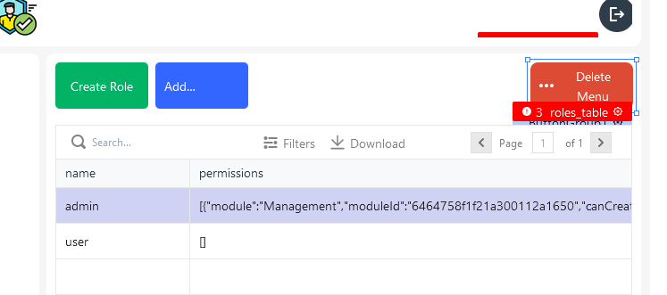
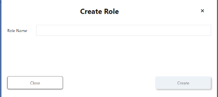
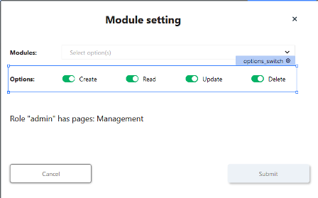

# AdminRoles

## Page



### Button1 (Create Role)

onClick

```js
{{showModal('ModalCreateRole')}}
```

### Button2 (Add Permissions To Role)

Disabled

```
{{!roles_table.selectedRow._id}}
```

onClick

```js
{{showModal('ModalAddModule')}}
```

### ButtonGroup1

Disabled

```js
{{!roles_table.selectedRow._id}}
```

#### Delete Menu

Menu Items

##### Delete Module from Role

onClick

```js
{{showModal('ModalDeleteModuleFromRole')}}
```

##### Delete Role

onClick

```js
{{deleteRole.run(
    () => getRoles.run(), 
    () => {}
)}}
```

### roles_table

Table Data

```js
{{getRoles.data}}
```

## Modal: ModalCreateRole



### FormButton2 (Close)

onClick

```js
{{closeModal('ModalCreateRole')}}
```

### FormButton1 (Create)

onClick

```js
{{createRole.run(
    () => getRoles.run(
        ()=>closeModal("ModalCreateRole")), 
    () => {}
)}}
```

### role_name_field


## Modal: ModalAddModule



### modules_field (Modules:)

Options

```js
{{getModules.data.filter(
    i => !roles_table.selectedRow.permissions.some(
        e => i.name === e.module //імя модуля = є в імені в permissions 
    )
).map(
    (item)=>{
        return{
            label:item.name, 
            value:item._id
        }
    }
)}}
```

Default Value

```
[]
```

### options_switch (Options:)

Options

```json
[
  {
    "label": "Create",
    "value": "C"
  },
  {
    "label": "Read",
    "value": "R"
  },
  {
    "label": "Update",
    "value": "U"
  },
  {
    "label": "Delete",
    "value": "D"
  }
]
```

Default Selected Values

```
[
  "C","R", "U", "D"
]
```

### Text7

Text

```js
Role "{{roles_table.selectedRow.name}}" has pages: {{roles_table.selectedRow.permissions.map(
    i => `${i.module}`
).join(',  ')}}
```

### FormButton5 (Submit)

onClick

```js
{{addModuleToRoles.run(
    () => getRoles.run(
        ()=>closeModal("ModalAddModule")
    ), () => {}
)}}
```


## APIs

### addModuleToRoles

```
POST {{main.env.nodeUrl}}/addModuleToRole
```

body

```json
{
	"_id":"{{roles_table.selectedRow._id}}",
	"moduleValue": {{modules_field.selectedOptionValues}},
	"moduleName": {{modules_field.selectedOptionLabels}},
	"options": {{options_switch.selectedValues}}
}
```

[Потік Node-RED](node_addmodulestoroles.md)

### createRole

```
POST {{main.env.nodeUrl}}/createRole
```

body

```json
{
		"name":"{{role_name_field.text}}"
}
```

[Потік Node-RED](node_createRole.md)

### deleteModuleFromRole

```
DELETE {{main.env.nodeUrl}}/deleteModuleFromRole
```

body

```json
{
	"_id": "{{roles_table.selectedRow._id}}",
	"moduleId": {{modules_field_delete.selectedOptionValues}}
}
```

[Потік Node-RED](node_deleteModuleFromRole.md)

### deleteRole

```
DELETE {{main.env.nodeUrl}}/deleteRole
```

body

```json
{
	"_id": "{{roles_table.selectedRow._id}}"
}
```

[Потік Node-RED](node_deleteRole.md)

### getModules

```
GET {{main.env.nodeUrl}}/getModules
```

- [x] Run API on Page load 

[Потік Node-RED](node_getModules.md)

### getRoles

```
GET {{main.env.nodeUrl}}/getRoles
```

- [x] Run API on Page load 

[Потік Node-RED](node_getRoles.md)