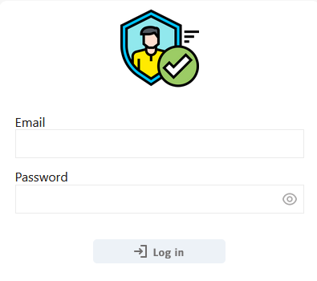
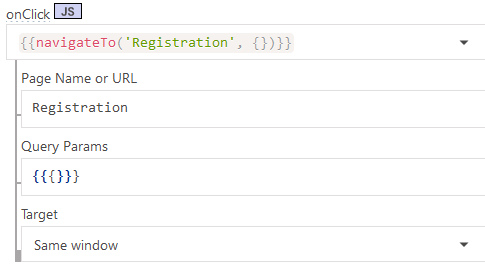
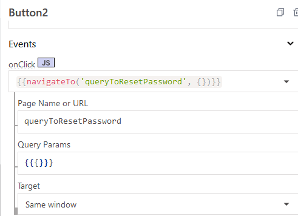

# Login

## Page



### BtnLogIn

```js
{{login.run(() => navigateTo('User Management', {}), () => {})}}
```

### BtnLogUp



### Button2



## APIs

### login

```
POST {{main.env.nodeUrl}}/login
```

body

```json
{
	"email":"{{email_field.text}}",
	"password":"{{pass_field.text}}"
}
```

[Потік Node-RED](node_login.md)

### signout

```
POST {{main.env.nodeUrl}}/signout
```

- [ ] Run API on Page load

[Потік Node-RED](node_signout.md)