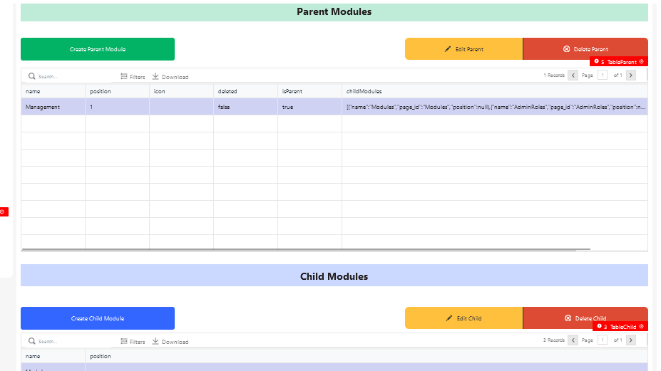
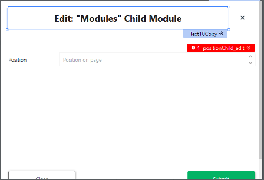
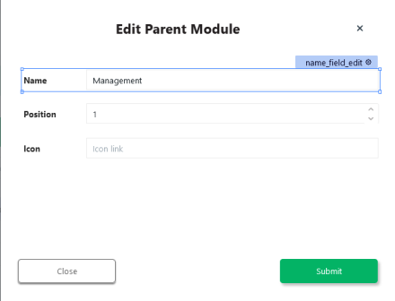
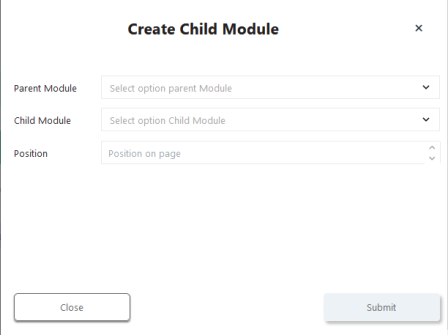
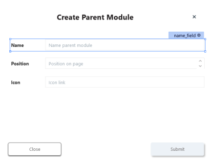

# Modules

## Page



### Button1 (Create Parent Module)

onClick

```
{{showModal('ModalCreateParent')}}
```

### ButtonGroupParent

#### Edit Parent

Disabled

```
{{!TableParent.selectedRow._id}}
```

onClick

```
{{showModal('ModalEditParent')}}
```

#### Delete Parent

Disabled

```
{{!TableParent.selectedRow._id}}
```

onClick

```js
{{deleteParentModule.run(
    () => getModules.run(), 
    () => {})}}
```

### TableParent

Table Data

```
{{getModules.data}}
```

### Button5 (Create Child Module)

onClick

```
{{showModal('ModalCreateChild')}}
```

### ButtonGroupChild

#### Edit Child

Disabled

```
{{!TableChild.selectedRow.name}}
```

onClick

```
{{deleteChildModule.run(() => getModules.run(), () => {})}}
```


#### Delete Child

Disabled

```
{{!TableChild.selectedRow.name}}
```

onClick

```js
{{deleteChildModule.run(() => getModules.run(), () => {})}}
```

### TableChild

Table Data

```
{{getModules.data.filter(item=>item._id==TableParent.selectedRow._id)[0].childModules}}
```


## ModalEditChild



### Text10Copy

Text

```js
Edit: "{{TableChild.selectedRow.name}}" Child Module
```


### positionChild_edit

Default Text

```
{{TableChild.selectedRow.position}}
```

### FormButton2Copy (Submit)

onClick

```js
{{updateChildModule.run(
    () => getModules.run(
        ()=> closeModal("ModalEditChild")), 
    () => {}
)}}
```


## ModalEditParent



### name_field_edit

Default Text

```
{{TableParent.selectedRow.name}}
```

### position_field_edit

Default Text

```
{{TableParent.selectedRow.position}}
```

### icon_field_edit

Default Text

```
{{TableParent.selectedRow.icon}}
```

### FormButton1Copy (Submit)

onClick

```js
{{updateParentModule.run(
    () => getModules.run(
        ()=>closeModal("ModalEditParent")), 
    () => {}
)}}
```


## ModalCreateChild



### parentModule1_field

Options

```js
{{getModules.data.map(
    (item)=>{return{
        label:item.name, 
        value:item._id}}
)}}
```

### childModule_field

Options

```js
{{getAppPages.data.data.pages.map(
    (item)=>{return{
        label:item.name, 
        value:item.name}}
)}}
```

### positionChild


### FormButton2 (Submit)

onClick

```js
{{createChildModule.run(
    () => getModules.run(
        ()=> closeModal("ModalCreateChild")), 
    () => {}
)}}
```


## ModalCreateParent



### name_field

### FormCreateParent

### icon_field

### FormButton1 (Submit)

onClick

```js
{{createParentModule.run(
    () => getModules.run(
        ()=>closeModal("ModalCreateParent")), () => {}
)}}
```


## APIs

### createChildModule

```
POST {{main.env.nodeUrl}}/createChildModule
```

body

```json
{
	"childModule":"{{childModule_field.selectedOptionValue}}",
	"parentModule":"{{TableParent.selectedRow._id}}",
	"position":{{positionChild.text}}
}
```

[Node-RED](node_createChildModule.md)

### createParentModule

```
POST {{main.env.nodeUrl}}/createParentModule
```

body

```json
{
	"name": "{{name_field.text}}",
	"position": {{position_field.text}},
	"icon": "{{icon_field.text}}"
}
```

[Node-RED](node_createParentModule.md)

### deleteChildModule

```
DELETE {{main.env.nodeUrl}}/deleteChildModule
```

body

```json
{
	"_id":"{{TableParent.selectedRow._id}}",
	"childModule_id":"{{TableChild.selectedRow.name}}"
}
```

[Node-RED](node_deleteChildModule.md)

### deleteParentModule

```
DELETE {{main.env.nodeUrl}}/deleteModule
```

body

```json
{
	"_id": "{{TableParent.selectedRow._id}}"
}
```

[Node-RED](node_deleteParentModule.md)

### getAppPages

```
GET {{main.env.uiUrl}}/api/v1/pages
```

- [x] Run API on Page load 

### getModules

```
GET {{main.env.nodeUrl}}/getModules
```

- [x] Run API on Page load 

[Node-RED](node_getModules.md)

### updateChildModule

```
PUT {{main.env.nodeUrl}}/updateChildModule
```

body

```json
{
	"_id": "{{TableParent.selectedRow._id}}",
	"position": "{{positionChild_edit.text}}",
	"name": "{{TableChild.selectedRow.name}}"
}
```

[Node-RED](node_updateChildModule.md)

### updateParentModule

```
PUT {{main.env.nodeUrl}}/updateParentModule
```

body

```json
{
	"name": "{{name_field_edit.text}}",
	"position": {{position_field_edit.text}},
	"icon": "{{icon_field_edit.text}}",
	"_id": "{{TableParent.selectedRow._id}}"
}
```

[Node-RED](node_updateParentModule.md)
