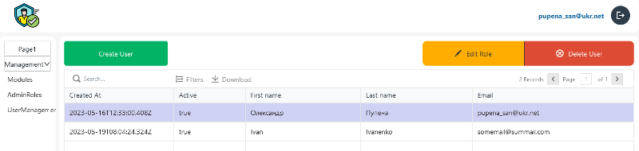
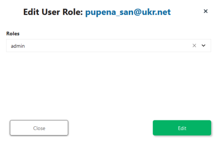

# User Management

## Page



### Button5 (Create User)

onClick

```js
{{showModal('ModalCreateUser')}}
```

### ButtonGroup1

#### Edit Role

Disabled

```js
{{!Table1.selectedRow._id}}
```

onClick

```
{{showModal('ModalEditRole')}}
```

#### Delete User

Disabled

```js
{{!Table1.selectedRow._id}}
```

onClick

```js
{ { deleteUser.run(() => getUsers.run(), () => {}) } }
```

### Table1

Table Data

```js
{{getUsers.data}}
```

## ModalEditRole



### Text1Copy

Text

```js
Edit User Role: {{Table1.selectedRow.email || ""}}
```

### field_user_role

Options

```js
{{getAllRoles.data.map(e=>{
	return{
		"label": e.name,
		"value": e._id
	}
})}}
```

Default Value

```js
{
"label": "{{Table1.selectedRow.role_items[0].name
}}",
"value": "{{Table1.selectedRow.role_items[0].id
}}"
}
```

### Button3Copy (Edit)

onClick

```js
{{JSObject1.editUserRole()}}
```


## ModalCreateUser


### confirm_pass_field

Valid

```js
{{pass_field.text ===confirm_pass_field.text}}
```

Error Message

```
Passwords must be the matching
```

### field_add_user_role

Options

```js
{{getAllRoles.data.map(e=>{
	return{
		"label": e.name,
		"value": e._id
	}
})}}
```

Default Value

```
{
"label": "User",
"value": "634fe97d28c82b00103cd25d"
}
```

### BtnCreateUser 

onClick

```js
{{JSObject1.createUser()}}
```


## APIs

### createUser

```
POST {{main.env.nodeUrl}}/createUser
```

body

```json
{
	"firstname": "{{firstname_field.text}}",
	"lastname": "{{lastname_field.text}}",
	"email": "{{email_field.text}}",
	"password": "{{pass_field.text}}",
	"role": "{{field_add_user_role.selectedOptionValue}}"
}
```

[Node-RED](node_createUser.md)

### deleteUser

```
DELETE {{main.env.nodeUrl}}/deleteUser
```

[Node-RED](node_deleteUser.md)

### editUserRole

```
PUT {{main.env.nodeUrl}}/editUserRole
```

body

```js
{
	"role": "{{field_user_role.selectedOptionValue}}",
	"_id": "{{Table1.selectedRow._id}}"
}
```

[Node-RED](node_editUserRole.md)

### getAllRoles

```
GET {{main.env.nodeUrl}}/getAllRoles
```

[Node-RED](node_getAllRoles.md)

### getUsers

```
GET {{main.env.nodeUrl}}/getUsers
```

[Node-RED](node_getUsers.md)

### JSObject1

```js
export default {
	editUserRole: async () => {
		await editUserRole.run();
		closeModal('ModalEditRole');
		getUsers.run();
	},
	createUser: async () => {
		await createUser.run();
		closeModal('ModalCreateUser');
		getUsers.run();
	}
}
```

