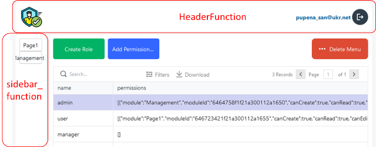

[До розділу](README.md)

# Реалізація авторизаційного шаблону в UI

Сторінки інтерфейсу можуть бути доступним всім, або конкретній ролі. За замовченням в профілі налаштовані наступні сторінки з шаблону:

- [Login](page_login.md) - сторінка входу в систему користувача
- [Registration](page_registration.md) - самостійна реєстрація користувача, тобто для створення нового користувача
- [Info](page_Info.md) - сторінка повідомлення про відправлення на пошту запиту на підтвердження пошти
- [Registered](page_registered.md) - сторінка повідомлення про про відправлення на пошту запиту на підтвердження пошти
- [queryToResetPassword](page_querytoResetPassword.md) - сторінка запиту на скидання паролю
- [ResetPassword](page_ResetPassword.md) - сторінка створення нового паролю при запиті на скидання паролю
- [PasswordChanged](page_PasswordChanged.md) - сторінка про успішне скидання паролю

При створенні профілю адміністратора йому необхідно надати доступ до таких сторінок шаблону: 

- [Modules](page_modules.md) - сторінка для створення та редагування модулів, що означують доступ до сторінок  
- [AdminRoles](page_adminroles.md) - сторінка для створення та редагування ролей та надання їм дозволів на доступ до модулів
- [UserManagement](page_usermanagement.md) - сторінка для створення та редагування користувачів 

Сторінки адміністратора та усі інші сторінки використовуються за шаблоном, в якому видимі:

- заголовок нагорі, який реалізований як [HeaderFunction](header_function.md)
- бокова панель з меню, яка реалізована як [SidebarFunction](sidebar_function.md)

Загальні налаштування користувацького інтерфейсу описані [за цим посиланням](app_cfg.md).