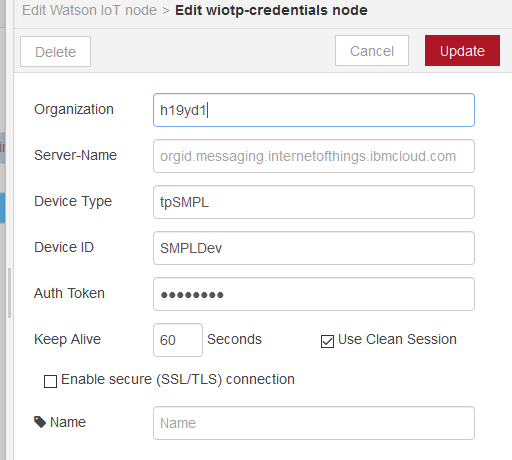
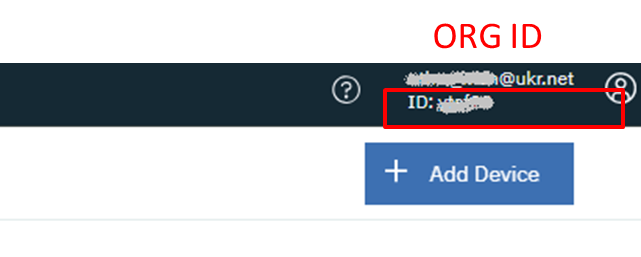

## wiotp credentionals (конфігураційний вузол означення повноважень доступу)

Конфігурування повноважень для доступу до двійників пристроїв в IBM Watson IoT, відбувається в даному конфігураційному вузлі (рис.14.1).

рис.14.1. Налаштування вузла wiotp credentionals

У полі Organization вказується ORG ID IBM Watson IoT. Його можна побачити в правому верхньому кутку консолі налаштування сервісу IBM Watson IoT або у відповідному полі вкладки Settings (рис.14.2).

рис.14.2.Визначення ORG ID в IBM Watson IoT

У полі Server-Name вказується ім’я серверу. Імя серверу вказується в форматі: 

`org_id.messaging.internetofthings.ibmcloud.com`

де *org_id* – це Ваш ORG ID IBM Watson IoT. Якщо це поле залишити порожнім Server-Name сформується автоматично. Слід зазначити що так само формується ім’я серверу у випадку використання вузлів MQTT. Додатково про налаштування зв’язку по MQTT можна прочитати [за цим посиланням](https://console.bluemix.net/docs/services/IoT/iotplatform_task.html#iotplatform_task). 

​      У Device Type та Device ID вказуються назви типів та пристроїв, які означені в Watson IoT Platform. При створенні пристрою йому надається маркер доступу, Auth Token, який вказується у однойменному полі. Слід зазначити, що при створенні пристрою, Auth Token необхідно кудись записати, бо потім він буде недоступним для перегляду. Інші налаштування аналогічні як у вузла Mqtt-broker.   