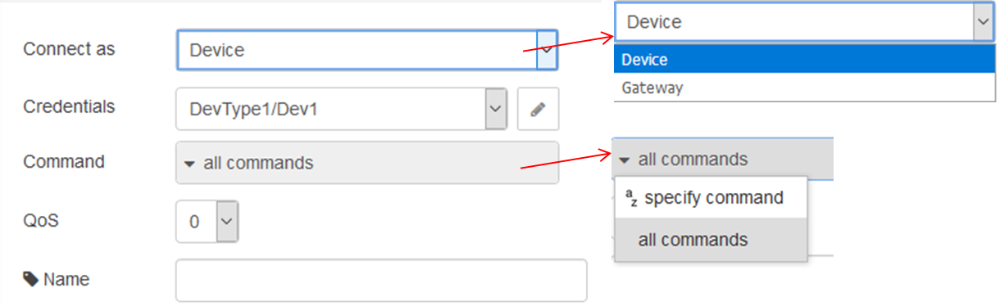

## wiotp in (вхід команди для IoT)

Отримує команди для пристроїв/шлюзів з платформи IBM Watson Internet of Things (рис.14.3).

рис.14.3. Налаштування вузла wiotp in

Вузол може підключатися як пристрій (Device) або шлюз(Gateway):

- Пристрій(**Device**): вузол може бути налаштований на отримання всіх команд для пристрою або тільки вибраного типу.

- Шлюз(**Gateway**): вузол може бути налаштований на прийом команд для всіх пристроїв, підключених через шлюз, або для вибору підмножини з них.

Повідомлення, надіслане цим вузлом, буде містити такі властивості:

•     `payload` - тіло команди. Якщо команда була ідентифікована як json, ця властивість буде об'єктом JavaScript, інакше це буде string.

•     `topic` - тема, на яку було отримано команду

•     `command` - ім'я команди

•     `format` - формат команди

•     `deviceType` - (тільки для шлюзу) типу пристрою, для якого призначена команда

•     `deviceId` - (тільки для шлюзу) ідентифікатора пристрою, для якого призначена команда

•     `server-name` - (необов'язково) ім'я кінцевої точки обміну повідомленнями Watson IoT Platform. За замовчуванням це значення буде рівним: 

`[organization id].messaging.internetofthings.ibmcloud.com` (Watson IoT Production server). Властивість mqtt_host облікових даних служби Watson IoT несе значення імені кінцевої точки обміну повідомленнями.

Можуть бути вказані значення для QoS (Quality of Service) і значення keep alive interval (див.MQTT).