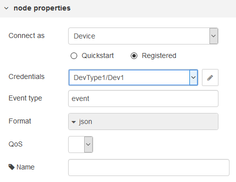

[<- На головну](../)  [Розділ](README.md)

## wiotp out (вихід повідомлення від IoT)

Надсилає події пристрою до платформи IBM Watson Internet of Things (рис.14.4).

рис.14.4. Налаштування вузла wiotp out

Вузол може підключатися як пристрій (Device) так і як шлюз (Gateway). він може працювати в режимі «registered» або як «Quickstart». При підключенні в режимі Quickstart з'єднання буде проводитися з існуючим тестовим сервером, використовувати тип пристрою `node-red-wiotp` і вказаний ідентифікатор пристрою. Події з вузла можуть бути переглянуті на панелі інструментів тестового серверу [Quickstart dashboard](https://quickstart.internetofthings.ibmcloud.com/).

Тип відправленої події (event type) може бути налаштований у вузлі або, якщо залишений порожнім, може бути встановлений властивістю `msg.event`. У випадку, якщо використовується сервіс Quickstart, тип події повинен бути встановлений у значення `event`.

Формат події типово є `json`, але може бути встановлений на інше значення або, якщо він залишений порожнім, може бути встановлений властивістю `msg.format`.

Дані для події беруться з `msg.payload`. Якщо формат встановлено на `json`, цей вузол намагатиметься відповідним чином кодувати дані:

- Якщо дані є об'єктом форми: `{ d: { ... }}` вони будуть передаватися у тому ж самому вигляді. Аналогічно, якщо це строкове представлення такого об'єкта, подальшого кодування не буде зроблено.

- Для будь-якого іншого типу об'єкта, наприклад числового, значення буде перетоврену в вигляд `{"d":{"value":123}}`

Така структура повідомлення пристрою продиктована форматом означеним в IBM Cloud, короткий опис доступний за [цим посиланням](https://console.bluemix.net/docs/services/IoT/devices/mqtt.html#message-format). 

Якщо `format` встановлено в значення other, дані будуть передаватися в такому вигляді як приходять на вхід.

При підключенні в якості шлюзу, тип і ідентифікатор Device, на який надсилається подія від його імені, може бути налаштований у вузлі або, якщо поле залишено порожнім, може бути встановлений властивостями `msg.deviceType` і `msg.deviceId`. Якщо ці властивості не надаються, або в вузлі, або в повідомленні, вузол буде використовувати тип і ідентифікатор самого шлюзу.

Інші налаштування аналогічні як в вузлах MQTT.