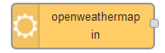
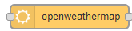
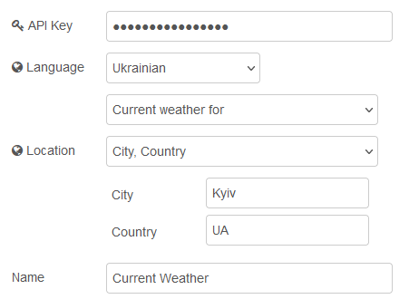

# node-red-node-openweathermap 

https://flows.nodered.org/node/node-red-node-openweathermap

Отримує звіт про погоду та прогноз погоди з OpenWeatherMap.

**Примітка.** Для використання цих вузлів потрібен ключ API. Щоб отримати ключ API, перейдіть до  [OpenWeatherMap](http://openweathermap.org/appid).

### Input Node

Отримує поточну погоду або прогноз на 5 днів у місці, визначеному `city and country` або `latitude and longitude` кожні 10 хвилин - і виводить **msg**, якщо щось змінилося.

### Query node

Приймає вхідні дані для ініціювання отримання поточної погоди з указаного `city and country` або `latitude and longitude` або передається на:

- `msg.location.city` та `msg.location.country` або
- `msg.location.lat` та `msg.location.lon`

Вузол завжди матиме пріоритет своїх налаштувань над властивостями повідомлення.

Мову звіту можна встановити за допомогою випадаючого меню. Вузол підтримує всі мови, надані OpenWeatherMap.

### Результат

Поточний прогноз погоди встановлює такі властивості `msg.payload`:

- `description` -  короткий словесний опис поточної погоди для читання людиною.
- `weather` - дуже короткий опис поточної погоди.
- `detail` - a more detailed version of `weather`.
- `icon` - код значка погоди для поточних умов.
- `id` - ідентифікатор, наданий OpenWeatherMap поточній погоді
- `tempk` - поточна температура землі в цьому місці в градусах Кельвіна.
- `tempc` - поточна температура землі в цьому місці в градусах Цельсія.
- `humidity` - поточна відносна вологість у місці розташування у відсотках.
- `maxtemp` - поточна максимальна температура в цьому місці в Кельвінах.
- `mintemp` - поточна мінімальна температура в цьому місці в Кельвінах.
- `windspeed` - поточна швидкість вітру в цьому місці в метрах за секунду.
- `winddirection` - поточний напрям вітру в місці розташування в метеорологічних градусах.
- `location` - назва місця, з якого були отримані дані.
- `sunrise` - час сходу сонця у форматі Unix UTC.
- `sunset` - час, коли зайде сонце у форматі Unix UTC.
- `clouds` - поточне хмарне покриття місця у відсотках.
- `rain` - кількість опадів у мм/год (лише якщо йде дощ).

Повернуться значення:

5-денний прогноз створює масив із 40 частин (5 днів x 8, 3-годинні інтервали) у `msg.payload` об’єктів із такими властивостями:

- `dt` - позначка часу епохи     
- `pressure` - в гектопаскалях (в 100 Па)     
- `humidity` - в %        
- `speed` - швидкість вітру в метрах за секунду      
- `deg` - напрям вітру в градусах        
- `clouds` - хмарність у %    
- `temp`   \- об'єкт з різними температурами в градусах C,
  - day, min, max, night, eve, morn
- `weather`  \- об'єкт з різними даними,
  - description, icon, main, id

Комбінована поточна погода/прогноз створює три властивості в `msg.payload`:

- `current` - поточна погода       
- `hourly` - погодинний прогноз на наступні 48 годин      
- `daily` - добовий прогноз на 7 днів  

Якщо він доступний, також надається щохвилинний прогноз

Зауважте, що в цьому випадку необхідно надати координати

Вузол також встановлює такі властивості `msg.location`.

- `lat` - широта місця, з якого були отримані дані.
- `lon` - довгота місця, з якого були отримані дані.
- `city` - місто, з якого були отримані дані.
- `country` - країна, з якої надійшли дані.

Нарешті, вузол встановлює:

- `msg.time` - час, коли openweathermap.org отримав дані про погоду.
- `msg.data` - повний JSON, повернутий API.

Дані про погоду надані [OpenWeatherMap.org/](http://openweathermap.org/)