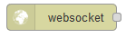
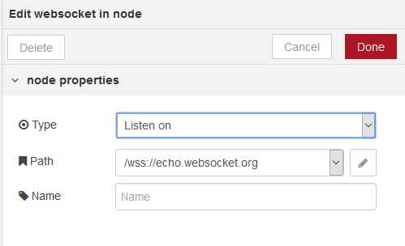

## WebSocket in

 Вхідний вузол WebSocket (рис.9.3). 

рис.9.3. Налаштування WebSocket in

За замовчуванням, дані, отримані з WebSocket, будуть знаходитись у `msg.payload`. Сокет може бути налаштований так, щоб очікувати правильно сформованого JSON-рядку, і в цьому випадку він розбирає JSON і надсилає отриманий об'єкт як ціле повідомлення. Додатково про WebSocket можна почитати за наступними посиланнями:

·     https://uk.wikipedia.org/wiki/WebSocket 

·     https://tproger.ru/translations/what-are-web-sockets/

·     https://www.websocket.org/echo.html 

·     https://www.pubnub.com/blog/2015-01-05-websockets-vs-rest-api-understanding-the-difference/