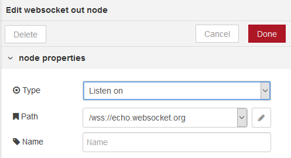

## 9.3. WebSocket out

 Вихідний вузол WebSocket (рис.9.4).

рис.9.4. Налаштування WebSocket out

За замовчуванням `msg.payload` відправляє через WebSocket. Сокет може бути зконфігурований так, щоб кодувати весь об'єкт `msg` як рядок JSON і посилати його через WebSocket.

Якщо повідомлення, що надходить на цей вузол, запущено в вузлі WebSocket In, повідомлення буде відправлено клієнту, який ініціював потік. В іншому випадку повідомлення буде транслюватися всім підключеним клієнтам.

Якщо ви хочете передати повідомлення, яке розпочалося в вузлі WebSocket In, ви повинні видалити властивість `msg._session` з потоку.